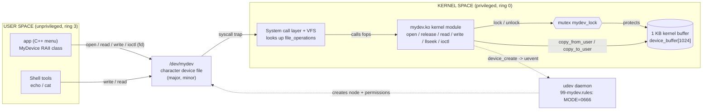
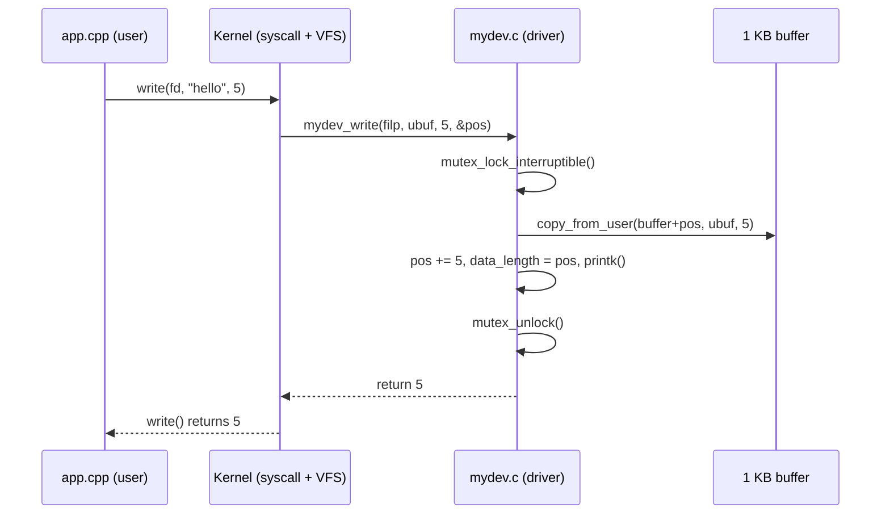

# Linux Virtual Character Device Driver (C + C++)
### Wipro Centre of Excellence (CoE) Training Program

A comprehensive systems programming project for **Ubuntu 24.04** demonstrating the complete path from an unprivileged C++ user-space application, through POSIX system calls and the VFS layer, into a privileged Linux kernel module. **No hardware is needed**: the driver simulates physical hardware using a 1 KB memory buffer in kernel space.

| File | What it is |
|------|------------|
| [`mydev.c`](mydev.c) | Kernel module (C). Registers `/dev/mydev` with `open`, `release`, `read`, `write`, `llseek`, `ioctl`. Stores data in a 1 KB buffer protected by a mutex and logs with `printk`. |
| [`mydev_ioctl.h`](mydev_ioctl.h) | Shared header: buffer size and ioctl command numbers, used by **both** the kernel and the app. |
| [`app.cpp`](app.cpp) | C++17 user program with a menu: write a string, read it back, clear the buffer, and query the size with ioctl. |
| [`Makefile`](Makefile) | Builds `mydev.ko` (via the kernel's Kbuild) and `app` (via `g++`). |
| [`mydev.sh`](mydev.sh) | Load/unload/status script. Installs a **udev rule** so `/dev/mydev` is usable without `sudo`. |

---

## 1. Overview

1. `insmod mydev.ko` runs `mydev_init()`. This function gets a major/minor number, registers a
   `cdev` with a table of file operations, and creates a device class and device.
2. The kernel sends a *uevent*. **udev** creates `/dev/mydev`, and our rule sets its mode to `0666`.
3. `./app` calls `open("/dev/mydev")` and gets back a **file descriptor**.
4. Each menu choice makes a **system call** (`write`, `read`, `lseek`, `ioctl`). The kernel's VFS
   layer passes each call to the matching function in `mydev.c`.
5. The driver locks its **mutex** and copies bytes between user memory and the kernel buffer with
   `copy_from_user` / `copy_to_user`. Then it unlocks.
6. `rmmod mydev` runs `mydev_exit()`, which undoes everything.

### Device behaviour

| Operation | Behaviour |
|-----------|-----------|
| `write()` | Writes at the file position. Afterwards, the stored data **ends where the write ended**, so a short message fully replaces a longer one. If the data is bigger than 1 KB, the driver keeps the part that fits and returns a smaller count. If the buffer is full, it returns `ENOSPC`. |
| `read()` | Returns bytes from the file position up to the end of the stored data. Returns `0` (EOF) at the end, so `cat` works. |
| `lseek()` | `SEEK_SET` / `SEEK_CUR` / `SEEK_END`, limited to the range 0–1024. |
| `ioctl(MYDEV_IOC_CLEAR)` | Zeroes the buffer and sets the length to 0. |
| `ioctl(MYDEV_IOC_GET_SIZE, &int)` | Returns the capacity (1024). |
| `ioctl(MYDEV_IOC_GET_LEN, &int)` | Returns the number of bytes currently stored. |

---

## 2. Architecture



### What happens on a single `write()`



---

## 3. Build, Load, and Run

> [!IMPORTANT]
> Use a real Ubuntu 24.04 install or a virtual machine (VirtualBox, VMware, Hyper-V, or UTM).
> **WSL2 is not suitable for loading the module**, because it runs Microsoft's own kernel and
> doesn't provide the matching headers. You can still use WSL to compile `app.cpp`.

### 3.1 Install prerequisites

```bash
sudo apt update
sudo apt install build-essential linux-headers-$(uname -r)
```

### 3.2 Build

```bash
make            # builds mydev.ko and app
```

### 3.3 Load the driver

```bash
chmod +x mydev.sh
sudo ./mydev.sh load
```

### 3.4 Run the user app (no sudo needed, thanks to the udev rule)

```bash
./app
```

### 3.5 Quick test from the shell

```bash
echo "hello from the shell" > /dev/mydev
cat /dev/mydev
sudo dmesg | grep mydev | tail
```

### 3.6 Check status and unload

```bash
./mydev.sh status
sudo ./mydev.sh unload
make clean
```

> [!WARNING]
> **Secure Boot:** if `insmod` fails with `Key was rejected by service`, the kernel is refusing an
> unsigned module. You can either turn off Secure Boot in the VM/firmware settings, or sign the
> module with a MOK key (`mokutil` + `kmodsign`).

---

## 4. Sample Output

### Build and load

```text
$ make
make -C /lib/modules/6.8.0-45-generic/build M=/home/student/virtual-char-device-driver modules
  CC [M]  /home/student/virtual-char-device-driver/mydev.o
  MODPOST /home/student/virtual-char-device-driver/Module.symvers
  CC [M]  /home/student/virtual-char-device-driver/mydev.mod.o
  LD [M]  /home/student/virtual-char-device-driver/mydev.ko
g++ -std=c++17 -Wall -Wextra -O2 -o app app.cpp

$ sudo ./mydev.sh load
[mydev.sh] Installing udev rule -> /etc/udev/rules.d/99-mydev.rules
[mydev.sh] Inserting /home/student/virtual-char-device-driver/mydev.ko
[mydev.sh] Loaded. Device node:
crw-rw-rw- 1 root root 240, 0 Oct  4 19:02 /dev/mydev
[mydev.sh] Latest kernel messages:
[ 1234.567890] mydev: loaded - /dev/mydev ready (major 240, minor 0, buffer 1024 bytes)
```

### Running the app

```text
$ ./app
Opened /dev/mydev - file descriptor = 3

========== /dev/mydev menu ==========
 1) Write a string
 2) Read buffer
 3) Clear buffer (ioctl)
 4) Query buffer size (ioctl)
 5) Exit
Choose an option: 1
Enter text to store: Hello, kernel!
Wrote 14 byte(s) to /dev/mydev

Choose an option: 2
Read 14 byte(s): "Hello, kernel!"

Choose an option: 4
Buffer capacity : 1024 bytes
Bytes in use    : 14 bytes

Choose an option: 3
Buffer cleared.

Choose an option: 2
Buffer is empty.

Choose an option: 5
Goodbye!
```

(The menu is printed again before every prompt; the repeats are left out above.)

### Kernel log (`sudo dmesg | grep mydev`)

```text
[ 1234.567890] mydev: loaded - /dev/mydev ready (major 240, minor 0, buffer 1024 bytes)
[ 1301.112233] mydev: device opened (open handles now: 1)
[ 1308.445566] mydev: wrote 14 bytes (buffer now holds 14/1024)
[ 1311.778899] mydev: read 14 bytes (new position 14)
[ 1315.001122] mydev: ioctl GET_SIZE -> 1024
[ 1315.001150] mydev: ioctl GET_LEN -> 14
[ 1318.334455] mydev: ioctl CLEAR - buffer erased
[ 1322.667788] mydev: device closed (open handles now: 0)
[ 1400.990011] mydev: unloaded - goodbye
```

(The major number, timestamps, and paths will be different on your machine.)

---

## 5. Mapping to Course Topics

### 5.1 Linux kernel space vs user space

| Concept | Where you see it in this project |
|---------|----------------------------------|
| Two privilege levels | `app.cpp` runs in **user space** (CPU ring 3), where a crash only kills the app. `mydev.c` runs in **kernel space** (ring 0), where a bug can crash the whole system. |
| Separate memory | The app's string and `device_buffer` live in different address spaces. The driver **must** use `copy_from_user`, `copy_to_user`, and `put_user`, and never dereference a `__user` pointer directly. |
| Loading code into the kernel | `insmod` / `rmmod` call `module_init(mydev_init)` / `module_exit(mydev_exit)`. |
| Kernel logging | Kernel code can't use `printf`. It uses `printk(KERN_INFO ...)`, and you read the output with `dmesg`. |
| Concurrency in the kernel | Several processes can open `/dev/mydev` at the same time. `DEFINE_MUTEX(mydev_lock)` makes buffer access one-at-a-time, and `atomic_t open_count` counts opens without a lock. |
| Error conventions | Kernel functions return **negative errno** values (`-EFAULT`, `-ENOSPC`, `-ENOTTY`). In user space, these become `-1` plus `errno`, which the app turns into a `std::system_error`. |

### 5.2 File descriptors

- On Linux, "everything is a file". The driver shows up as `/dev/mydev`, and `ls -l` marks it with a
  `c` (character device) along with its **major, minor** numbers.
- `open()` returns a small integer, the **file descriptor** (usually `3`, because 0, 1, and 2 are
  stdin, stdout, and stderr). The app prints this number.
- Inside the kernel, each `open()` creates a separate `struct file` (`filp`), which has its **own file
  position** (`f_pos`). That's why the app calls `lseek(fd, 0, SEEK_SET)` before reading, and why
  `cat` (with its own fd) always starts at 0.
- `close()` releases the descriptor, and the kernel then calls `mydev_release()`. The C++ destructor
  makes sure this happens even if an error occurs (RAII).

### 5.3 System calls

| User call (`app.cpp`) | Kernel entry (`mydev.c`) | Purpose |
|-----------------------|--------------------------|---------|
| `open()` | `mydev_open()` | Start a session and get an fd |
| `write()` | `mydev_write()` | User string → kernel buffer |
| `lseek()` | `mydev_llseek()` | Move the file position |
| `read()` | `mydev_read()` | Kernel buffer → user memory |
| `ioctl()` | `mydev_ioctl()` | Device-specific commands (clear, get size, get length) |
| `close()` | `mydev_release()` | End the session |

The table that links each system call to a driver function is `struct file_operations mydev_fops`.
The ioctl numbers are built with `_IO` / `_IOR` in the shared header, so both sides agree on them.
You can watch the calls happen with `strace ./app`.

### 5.4 C++

- **RAII:** the `MyDevice` class opens the fd in its constructor and closes it in its destructor, so
  the fd can never leak.
- **Deleted copy operations** stop two objects from owning (and closing) the same fd.
- **Exceptions:** `std::system_error` with `std::generic_category()` turns `errno` into a readable
  message. Each menu action is wrapped in `try/catch`, so one failure doesn't end the program.
- **Standard library:** `std::string`, `std::vector<char>` (read buffer), `std::getline` (robust
  input), and `std::stoi`.
- **C interop:** the app calls C system-call wrappers (`::open`, `::read`, `::ioctl`) and includes
  the same C header as the kernel module.

### 5.5 Hardware / software architecture

- **Layered architecture:** application → C library wrappers → system call trap → VFS → device driver
  → "hardware". In this project, the hardware is replaced by a memory buffer. A real driver would
  access device registers or DMA memory at the point where we use `device_buffer`.
- **The driver as the hardware abstraction layer:** the app only knows the generic file API. The
  backing storage could be swapped for a real UART or sensor without changing `app.cpp`.
- **Device model:** major/minor numbers, `struct cdev`, `/sys/class/mydev_class`, and udev together
  show how Linux finds devices and exposes them to user space.
- **CPU privilege rings and protection:** user code can't reach kernel memory. Crossing the boundary
  takes a controlled trap (a system call) and explicit copying.
- **Synchronisation:** on multi-core CPUs, two processes may enter `mydev_write()` at the same time on
  different cores. The mutex prevents a race condition that would mix up the buffer contents.

---

## 6. Troubleshooting

| Symptom | Fix |
|---------|-----|
| `make: *** /lib/modules/.../build: No such file or directory` | `sudo apt install linux-headers-$(uname -r)` |
| `insmod: ERROR ... Key was rejected by service` | Secure Boot is on; turn it off or sign the module (see above). |
| `open(/dev/mydev): No such file or directory` | The module isn't loaded. Run `sudo ./mydev.sh load`. |
| `open(/dev/mydev): Permission denied` | Run `sudo ./mydev.sh reload` so the udev rule is installed again. |
| `rmmod: ERROR: Module mydev is in use` | Close `./app` (or any `cat`) that still has the device open. |
| `bash: ./mydev.sh: /usr/bin/env: 'bash\r'` | The file has Windows line endings. Run `sed -i 's/\r$//' mydev.sh Makefile`. |
